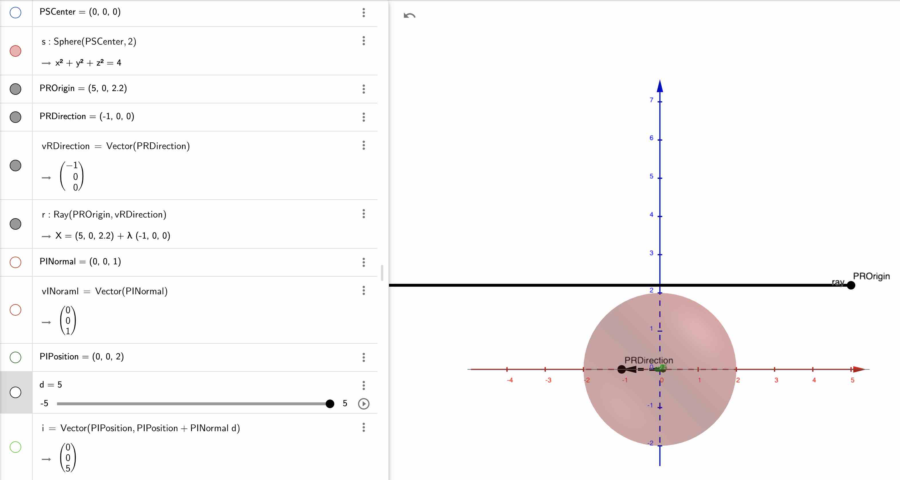
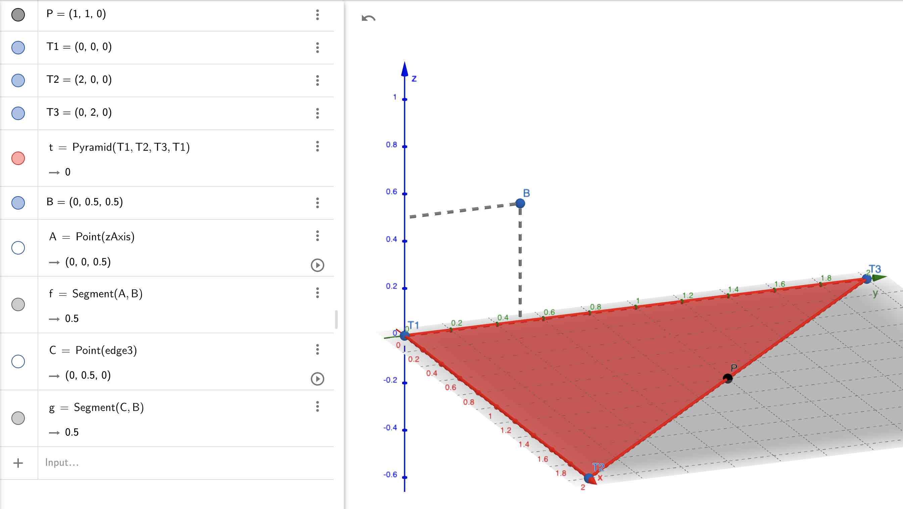

### Ray(Vector origin, Vector direction)
**Как задать луч по началу и вектору**  

`origin` - точка начала  
`direction` - вектор направления  


Второе значение - это не точка, а вектор.
То, если как будто этот вектор перенести в точку, от куда начинается луч.
Для простоты можно вычислить вторую точку, как: Начальная точка + Вектор, получится вторая точка, через которую можно провести луч.

### Vector CrossProduct
**Векторное произведение**


https://www.geogebra.org/3d/ubcqm2uz

Векторное произведение двух векторов в трёхмерном евклидовом пространстве — вектор, перпендикулярный обоим исходным векторам, длина которого численно равна площади параллелограмма, образованного исходными векторами, а выбор из двух направлений определяется так, чтобы тройка из по порядку стоящих в произведении векторов и получившегося вектора была правой[⇨]. Векторное произведение коллинеарных векторов (в частности, если хотя бы один из множителей — нулевой вектор) считается равным нулевому вектору.

https://ru.wikipedia.org/wiki/Векторное_произведение

### Length(const Vector& vec)
**Длина вектора**

`length = sqrt(x^2 + y^2 + z^2)` 


### Normal
**Нормаль**

Нужно, чтобы уменьшить размеры вектора.  
Делим каждую координату на размер вектора

### GetIntersection(ray, sphere)
**Пересечение луча и сферы**

#### Луч проходит мимо сферы
```
sphere = ( {0, 0, 0}, 2.);
ray    = { {5, 0, 2.2}, {-1, 0, 0} };
intersection = GetIntersection(ray, sphere);
// intersection = {}
```

https://www.geogebra.org/3d/y2xzeqda

#### Луч проходит ровно сквозь сферу
```
sphere = ( {0, 0, 0}, 2.);
ray =    { {5, 0, 0}, {-1, 0, 0} };
intersection = GetIntersection(ray, sphere);
// intersectionPosition = {2, 0, 0}
// intersectionNormal   = {1, 0, 1}
// intersectionDistance = 3
```

https://www.geogebra.org/3d/vhvkumcv

#### Луч касается верхней границы сферы
```
sphere = ( {0, 0, 0}, 2.);
ray =    { {5, 0, 2}, {-1, 0, 0} };
intersection = GetIntersection(ray, sphere);
// intersectionPosition = {0, 0, 2}
// intersectionNormal   = {0, 0, 1}
// intersectionDistance = 5
```
Луч доходит до сферы и отражается вверх

https://www.geogebra.org/3d/b6kd5srn

#### Луч исходит из центра сферы
```
sphere = ( {0, 0, 0}, 2.);
ray =    { {0, 0, 0}, {-1, 0, 0} };
intersection = GetIntersection(ray, sphere);
// intersectionPosition = {-2, 0, 0}
// intersectionNormal   = {1, 0, 0}
// intersectionDistance = 2
```

https://www.geogebra.org/3d/hjufgcqs

### GetIntersection(ray, triangle)
**Пересечение луча и треугольника**

#### Луч пересекает большую грань треугольника в центре 
```
triangle = { {0, 0, 0}, {4, 0, 0}, {0, 4, 0} };
ray =      { {2, 2, 1}, {0, 0, -1} };
intersection = GetIntersection(ray, triangle);
// intersectionPosition = {2, 2, 0}
// intersectionNormal   = {0, 0, 1}
// intersectionDistance = 1
```

https://www.geogebra.org/3d/vjanvxx8

#### Луч не пересекает треугольник
```
triangle = { {0, 0, 0}, {4, 0, 0}, {0, 4, 0} };
ray =      { {2, 2, 1}, {0, 0, -1} };
intersection = GetIntersection(ray, triangle);
// intersectionPosition = {2, 2, 0}
// intersectionNormal   = {0, 0, 1}
// intersectionDistance = 1
```

https://www.geogebra.org/3d/vjanvxx8

### Reflect
**Отражение**

```
normal = {0, 1, 0};
ray    = {0.7, -0.7, 0};
reflect = Reflect(ray, normal);
// reflect = {0.7, 0.7, 0}
```

https://www.geogebra.org/3d/zxrkzyuk

### Refract
**Преломление**

```
normal = {0, 1, 0};
ray    = {0.7, -0.7, 0};
refract_opt = Refract(ray, normal, 0.9);
// refract_opt = {0.63, -0.77, 0}
```

https://www.geogebra.org/3d/qqppyyha

### GetBarycentricCoords
**Барицентрические координаты**

#### Точка лежит на грани треугольника
```
triangle = { {0, 0, 0}, {2, 0, 0}, {0, 2, 0} };
on_edge  = GetBarycentricCoords(triangle, {1, 1, 0});
// on_edge = {0, 0.5, 0.5}
```

https://www.geogebra.org/3d/mzd3x82g

#### Точка лежит на вершине треугольника
```
triangle = { {0, 0, 0}, {2, 0, 0}, {0, 2, 0} };
on_vertex  = GetBarycentricCoords(triangle, {2, 0, 0});
// on_vertex = {0, 1, 0}
```

https://www.geogebra.org/3d/zgfpsnth

#### Точка лежит внутри треугольника
```
triangle = { {0, 0, 0}, {2, 0, 0}, {0, 2, 0} };
inside  = GetBarycentricCoords(triangle, {0.2, 0.2, 0});
// inside = {0.8, 0.1, 0.1}
```

https://www.geogebra.org/3d/r3ckswbp
